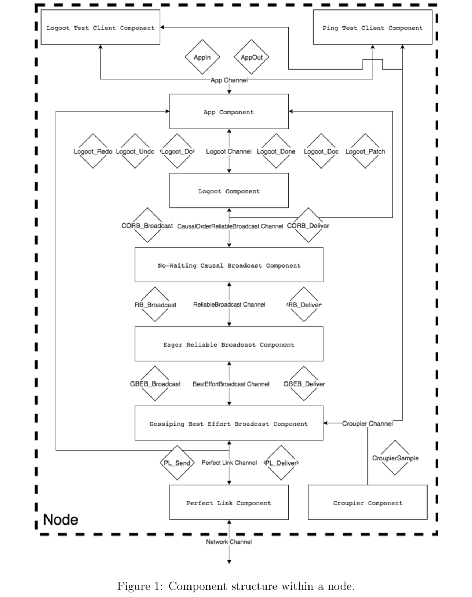

# Commutative Replicated Data Types Project
This project contians an implementation of the Logoot-Undo CRDT algorithm which is a peer-to-peer, fully decentralised Commutative Replicated Data Type system. The system was developed on top of the Kompics framework in Scala and tested using the Kompics simulator for the course Distributed Computing, Peer-to-Peer and GRIDS (ID2210) at KTH Royal Institute of Technology in Stockholm.

## Logoot-Undo
Logoot-undo is a CRDT algorithm that introduces the "undo-anywhere, anytime feature" in collaborative editing systems. CRDT algorithms ensure consistency without having to have to worry about concurrency because events performed by clients natively commute. Logoot-undo provides an elegant way to perform an undo operation in collaborative editing systems by controlling the visibility of patches.

The Logoot-Undo specification represents a text document as an ordered list where each line is associated with a line identifier and an identifier table is used to store the line identifiers. Each line identifier is unique and is represented as a non-mutable list of position tuples. Line identifiers are generated using a boundary strategy which sets a limit on the distance between two successive line identifiers. Clients are able to modify the document using insert/delete operations where each operation to the document modifies the identifier table. A line level degree is associated with each line identifier and determines the visibility of a line. An insert operation increments the degree while a remove operation decrements the degree. Operations by a peer are grouped into patches which have a patch level degree used for undo and redo of patches. The patch degree is decremented for every undo operation while a redo operation increments the value. The degree parameters prevent a line from being inserted more than once and a patch from being undone more than once, to name an example. A cemetery data structure(hashmap) is used to handle concurrent operations and stores line identifiers and a line degree which is strictly less than 0. Each client keeps a local history buffer to store patches that it has previously performed.

## Implementation
The CRDT system is made up of identical nodes or peers that communicate through message passing. Each peer has a set of neighbors that it communicates with provided by the croupier component in Ktoolbox. A peer or a node is divided into a number of components as is depicted in the figure below.

The following subsections explain and describe our implementation of each component within a peer.

### Test clients
There are two clients in the program one that checks if the infrastructure components behave correctly by sending out ping/pong messages and verifying that it produces the expected results. The other verifies if the logoot implementation behaves correctly using multiple different test scenarios.

### App Component
Acts as an interface for any client to our program. The component listens to the App Channel for AppIn events from clients and responds with AppOut events. It Forwards Ping messages to the Causal Broadcast Component and Logoot messages to the Logoot Component.

### Logoot Component
The Logoot Component implements the Logoot-Undo algorithm described in the Logoot-Undo: Distributed Collaborative Editing System on P2P networks paper.

This component listens to the Logoot Channel for Logoot_Do,Logoot_Undo and Logoot_Redo messages, and responds with Logoot_Done, Logoot_Doc and Logoot_Patch messages.

Upon receiving Logoot_Do it extracts the patch and generates line identifiers for the insert operations. Then it encapsulates the patch in a CORB_Broadcast message and sends it to the CausalOrderReliableBroadcast Channel.

Upon receiving Logoot_undo or Logoot_Redo it encapsulates the message in a CORB_Broadcast and sends it to the CausalOrderReliableBroadcast Channel.

Upon receiving Logoot_Doc it responds with the document object as a string.
The component listens to the CausalOrderReliableBroadcast Channel for CORB_Deliver messages.

When the CORB_Deliver message contains Logoot_Patch(patch:Patch) it executes the operations in the patch and adds it to the history buffer data structure.

When the CORB_Deliver message contains Logoot_Undo(patchId: UUID, _) it retrieves the patch from the history buffer, decreases the degree of the patch and if the degree is equal to 0 it execute the inverse of the operations in the patch.

When the CORB_Deliver message contains Logoot_Redo(patchId: UUID, _) it retrieves the patch from the history buffer, increases the degree of the patch and if the degree is equal to 1 it execute the operations in the patch.

### No-Waiting Causal Broadcast Component
Implements no-waiting causal broadcast algorithm. The component listens in on the CausalOrderReliableBroadcast channel for CORB_Broadcast messages and on the Reliable Broadcast channel for RB_Deliver messages.

When receiving a CORB_Broadcast message it is added to the components past data structure and forwarded to the Reliable Broadcast channel in a RB_Broadcast message with a copy of the components past data structure.

When the component receives an RB_Deliver it checks whether it has delivered the message before, for a new message the component runs through the past data structure in the message and checks for any message it has not delivered before. Messages it has not delivered before are sent to the CausalOrderReliableBroadcast channel in a CORB_Deliver message and added to the components past data structure. After that the component delivers the new message and adds it to its past.

### Eager Reliable Broadcast Component
Implements the eager reliable broadcast algorithm. It maintains a set of previously delivered messages to prevent delivering duplicates.

The component listens to the ReliableBroadcast Channel for RB_Broadcast messages and wraps them in a GBEB_Broadcas message before sending them to the BestEfforBroadcast Channel.

The component receives GBEB_Deliver messages from the BestEfforBroadcast Channel and delivers them to the component above(No-Waiting Causal Broadcast Component) in an RB_Deliver message as well as broadcasting the same messages back to the BestEfforBroadcast Channel.

### Gossiping Best Effort Broadcast Component
This component implements the gossiping best effort broadcast algorithm, allowing the peer to broadcast without knowing all the peers in the system. The component listens in on the Croupier Channel for random samples of the system provided by the Croupier Component in KToolbox.

The component listens to the BestEffortBroadcast Channel for GBEB_Broadcast messages that it adds to its past data structure. Upon receiving a sample from the Croupier Channel it sends out a HistoryRequest message to the peers in the sample using the Perfect Link Channel. When receiving a HistoryRequest on the Perfect Link Channel it responds with a HistoryResponse message to the sender with its past data structure. Lastly when receiving a HistoryResponse it takes the difference of the received past and its own past data structure and sends out the messages it has not seen before encapsulated in a GBEB_Deliver to the BestEffortBroadcast Channel.

### Perfect Link Component
The perfect link component is responsible for listening in on the Network Channel for BasicContentMsg messages. It extracts the content of the message and forwards it to the Perfect Link Channel. Additionally the component listens to the Perfect Link Channel for PL_Send messages from components above it inside of the peer. It extracts the payload of the message and encapsulates it in a PL_Deliver and then a BasicContentMsg before sending it to the Network Channel.

## Simulation Test Scenarios
The project description describes three simulation scenarios:
1. Assume a core of correct nodes - no churn. See that eventually all nodes deliver all broadcast messages.
2. Assume a core of correct nodes and an extension of nodes that are prone to churn. See that if a correct node sends a message, all correct nodes deliver this message.
3. Assume a core of correct nodes and an extension of nodes that are prone to churn. See that if a correct node delivers a message, all correct nodes deliver the message. Design your scenario such that the delivered message comes from a node belonging to the extension and not the core.

The first two simulation scenarios describe the validity property associated with Broadcast abstractions. If a correct process broadcasts a message m, then every correct process eventually delivers m. This property is a Liveness property. The Third simulation scenario describes the agreement property associated with reliable broadcast abstraction. If a message m is delivered by some correct process, then m is eventually delivered by every correct process. This property is a Liveness property.

As these properties are liveness properties it is impractical to test with 100% guarantee that the property will not be violated. The test scenarios would need to run for an infinite amount of time to be completely sure that the implementation works and does not violate the properties. However by running the simulation for a finite long time the scenarios can give some degree of confidence that the conditions of these properties will not be broken.

We implemented two test clients to test the following scenarios and properties the system should hold.

### Broadcast Test Scenarios
We implemented a PingTestClient to verify that the properties of the broadcast components would not invalidate its properties with a fair degree of certainty.

The following properties are verified using three different scenarios in the PingTestClient.
* No duplication property: No message is delivered more than once. - **Safety**
* No creation property: a process delivers a message m with sender s, then m was previously broadcast by process s. - **Safety**
* Validity property: If a correct process broadcasts a message m, then every correct process eventually delivers m. - **Liveness**
* Agreement property: a message m is delivered by some correct process, then m is eventually delivered by every correct process. - **Liveness**
* Causal delivery property: For any message m1 that potentially caused a message m2, i.e., m1 –> m2, no process delivers m2 unless it has already delivered m1. - **Safety**

### Logoot Test Scenarios
The LogootTestClient verifies that the Logoot-Undo implementation works as intended. The client runs through five scenarios each building on top of the other.
* The first scenario checks if the insert operation is able to add to the document.
* The second scenario verifies the correctness of the line degree variable by introducing remove operations.
* The third scenario introduces the undo of a patch and checks if the remove operations have been reverted.
* The fourth scenario introduces the redo of a patch and verifies that the remove operations have been re-executed.
* The fifth scenario verifies that the patch degree variable works as intended by double undoing a patch and then redoing the patch. Verifying that the outcome has not executed the remove operations.

## Additional Information
A working Scala version of the starter project can be found on the working-scala-starter branch

